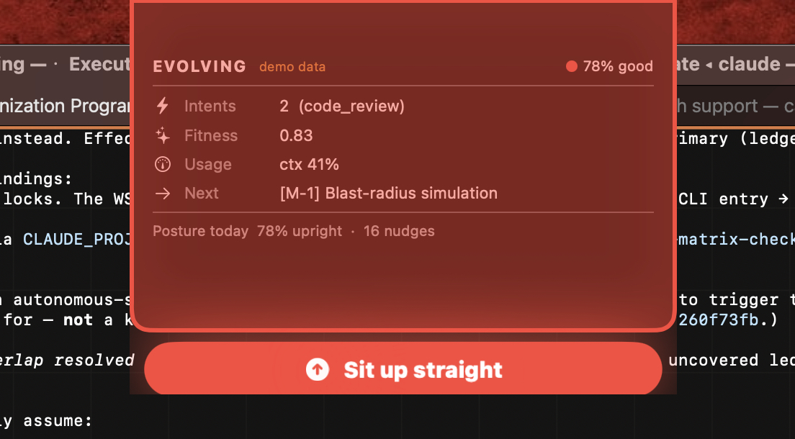
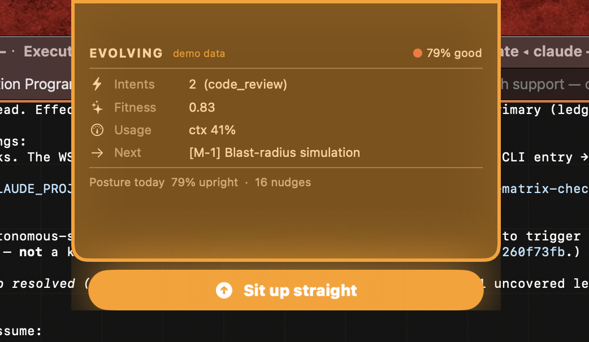

# PrimeEye

[](LICENSE)
[](https://www.apple.com/macos/)
[](https://swift.org)
[](Package.swift)



**Your MacBook notch, but it watches your back.** A tiny native app that lives in the notch: it nudges you when you slouch, and shows a glanceable status readout you can wire to anything. On-device, no dependencies, every line auditable.

> Not a framework, not a plugin, not part of any stack. Just a small thing that sits in the notch and quietly helps with two things you forget about while you work: your **posture** and a **glance** at whatever you care to keep an eye on.

## What it does

**Nudges you when you slouch.** The camera estimates your body pose on-device at ~3fps. It learns your upright baseline on first run, then a pulsing banner grows in the notch when you start hunching - amber first, red if you keep ignoring it - and clears the moment you sit back up. It pauses (and stops scoring you) when you step away from the Mac.

**Glanceable status in the notch.** A small readout: collapsed by default, hover to peek, click to expand. It renders whatever you feed it - context %, a build status, today's todo count, anything. Ships with an example provider; swap in your own (see below).

## What it looks like

| Gentle nudge (glow) | Escalated nudge (message) |
|---|---|
|  |  |

The expanded HUD sits above the banner: a few labelled rows plus the live posture readout for the day.

## Why

I spend hours in front of the Mac and my posture quietly falls apart. Existing posture apps are closed-source binaries that want camera access - no thanks. So I built one from scratch in pure Apple frameworks, where every line is readable, the camera feed never leaves the device, and nothing is ever stored. The notch HUD started as "while I'm up there anyway, show me something useful."

## Privacy

The camera feed is processed frame-by-frame on-device by Apple's `Vision` framework to estimate body pose. **No frame is ever written to disk or transmitted anywhere.** The only thing saved is a daily aggregate count (how many minutes upright, how many nudges). That's it.

## Build & run

```bash
git clone https://github.com/primeline-ai/PrimeEye.git
cd PrimeEye
./create-signing-identity.sh   # once: stable self-signed cert so the camera grant survives rebuilds
swift test                     # run the unit tests
./make-app.sh                  # build + bundle + sign PrimeEye.app
open PrimeEye.app              # grant camera on first run, sit upright ~5s to calibrate
```

Menu-bar eye icon: Recalibrate · Toggle posture · Start at login · Quit.

> The self-signed identity is optional but recommended - without a stable signature, macOS re-prompts for the camera permission on every rebuild. `make-app.sh` falls back to ad-hoc signing if you skip it.

**Requirements:** macOS 13 (Ventura)+, a Swift toolchain (5.9+). Built for Macs with a notch; falls back to a top-center HUD on notch-less displays.

## Start / Stop

`scripts/start-primeeye.command` and `scripts/stop-primeeye.command` are double-clickable. Stop kills the process and fully releases the camera (handy before closing the lid); Start re-opens it.

## Wire your own HUD data

The HUD just binds to fields on an `AppState` object (a count, a label, a value, a "next" item, a usage string, plus `dataLive`/`dataStale` honesty flags). A provider fills those fields.

`Sources/PrimeEye/ExampleDataProvider.swift` is a ~30-line static example. To show real data, copy it, then poll a file / hit an API / read a system metric on a timer and write the values onto `AppState` (on the main actor). Point `AppDelegate` at your provider. The posture warner is completely independent - the HUD is the optional second half.

```bash
PRIMEEYE_DEMO_STAGE=message open PrimeEye.app   # preview the nudge UI with no camera (glow|message)
```

## How it's built

- `Sources/PrimeEyeKit/` - pure, unit-tested logic: posture metrics, the escalation state machine, daily stats, calibration, notch geometry. No AppKit/AVFoundation, so it's testable in isolation.
- `Sources/PrimeEye/` - the AppKit/SwiftUI/Vision/AVFoundation glue: notch window, camera monitor, menu bar, the SwiftUI view, the HUD provider.
- Frameworks: AppKit, SwiftUI, Vision, AVFoundation, ServiceManagement, Foundation. **Nothing else** - zero third-party packages.

## License

MIT - see [LICENSE](LICENSE).
